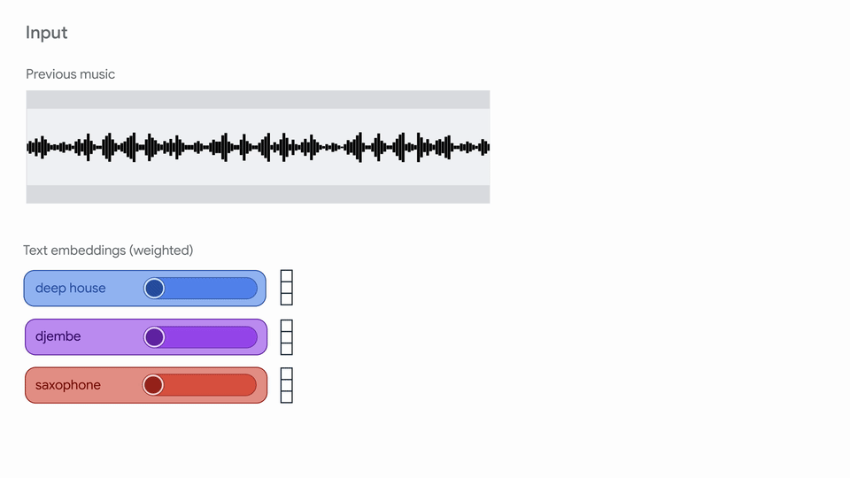

# Magenta RT: Streaming music generation!

Magenta RealTime is a Python library for streaming music audio generation on
your local device. It is the open source / on device companion to
[MusicFX DJ Mode](https://labs.google/fx/tools/music-fx-dj) and the
[Lyria RealTime API](https://ai.google.dev/gemini-api/docs/music-generation).

This is a 👀 sneak preview of the Magenta RT project. We will have
[more to share](#coming-soon) in the coming weeks including a technical report
and additional features!

See our [blog post](https://g.co/magenta/rt) and
[model card](https://github.com/magenta/magenta-realtime/blob/main/MODEL.md) for
more info.



## Getting started

<a target="_blank" href="https://colab.research.google.com/github/magenta/magenta-realtime/blob/main/notebooks/Magenta_RT_Demo.ipynb">
  
</a>

The fastest way to get started with Magenta RT is to try our official
[Colab Demo](https://colab.research.google.com/github/magenta/magenta-realtime/blob/main/notebooks/Magenta_RT_Demo.ipynb)
which runs in real time on freely available TPUs! Here is a quick
[video walkthrough](https://www.youtube.com/watch?v=SVTuEdeepVs).

If you have a machine with a TPU or GPU, you may also following the installation
instructions below for running locally.

## Local installation

Install the latest version:

```sh
# With GPU support:
pip install 'git+https://github.com/magenta/magenta-realtime#egg=magenta_rt[gpu]'
# With TPU support:
pip install 'git+https://github.com/magenta/magenta-realtime#egg=magenta_rt[tpu]'
# CPU only
pip install 'git+https://github.com/magenta/magenta-realtime'
```

Or, clone and install for local editing:

```sh
git clone https://github.com/magenta/magenta-realtime.git && cd magenta-realtime

python3.11 -m venv .venv
source .venv/bin/activate
python3.11 -m ensurepip --upgrade
pip install --upgrade pip
pip install pybind11 wheel setuptools

sudo apt-get update
sudo apt-get install -y python3-dev build-essential

pip install -e .[gpu]
```

## Examples

### Generating audio with Magenta RT

Magenta RT generates audio in short chunks (2s) given a finite amount of past
context (10s). We use crossfading to mitigate boundary artifacts between chunks.
More details on our model are coming soon in a technical report!

```py
from magenta_rt import audio, system
from IPython.display import display, Audio

num_seconds = 10
mrt = system.MagentaRT()
style = system.embed_style('funk')

chunks = []
state = None
for i in range(round(num_seconds / mrt.config.chunk_length)):
  state, chunk = mrt.generate_chunk(state=state, style=style)
  chunks.append(chunk)
generated = audio.concatenate(crossfade_time=mrt.crossfade_length)
display(Audio(generated.samples.swapaxes(0, 1), rate=mrt.sample_rate))
```

### Blending text and audio styles with MusicCoCa

MusicCoCa is a joint embedding model of text and audio styles. Magenta RT is
conditioned on MusicCoCa embeddings allowing for seamless blending of styles
using any number of text and audio prompts.

```py
from magenta_rt import audio, musiccoca

style_model = musiccoca.MusicCoCa()
my_audio = audio.Waveform.from_file('myjam.mp3')
weighted_styles = [
  (2.0, my_audio),
  (1.0, 'heavy metal'),
]
weights = np.array([w for w, _ in weighted_styles])
styles = style_model.embed([s for _, s in weighted_styles])
weights_norm = weights / weights.sum()
blended = (weights_norm[:, np.newaxis] * styles).mean(axis=0)
```

### Tokenizing audio with SpectroStream

SpectroStream is a discrete audio codec model operating on high-fidelity music
audio (stereo, 48kHz). Under the hood, Magenta RT models SpectroStream audio
tokens using a language model.

```py
from magenta_rt import audio, spectrostream

codec = spectrostream.SpectroStream()
my_audio = audio.Waveform.from_file('jam.mp3')
my_tokens = codec.encode(my_audio)
my_audio_reconstruction = codec.decode(tokens)
```

## Running tests

Unit tests:

```sh
pip install -e .[test]
pytest .
```

Integration tests:

```sh
python test/musiccoca_end2end_test.py
python test/spectrostream_end2end_test.py
python test/magenta_rt_end2end_test.py
```

## Coming soon!

The following is a list of features we have planned for the near future (subject
to change). Please open an issue if there are features you would like to see, or
open a pull request if you would like to contribute!

-   Technical report
-   Colab for fine tuning
-   Colab for conditioning on real-time audio input

## Citing this work

A technical report is coming soon. For now, please cite our blog post:

```
@article{magenta_rt,
    title={Magenta RealTime},
    url={https://g.co/magenta/rt},
    publisher={Google DeepMind},
    author={Lyria Team},
    year={2025}
}
```

## License and disclaimer

Magenta RealTime is offered under a combination of licenses: the codebase is
licensed under
[Apache 2.0](https://github.com/magenta/magenta-realtime/blob/main/LICENSE),
and the model weights under
[Creative Commons Attribution 4.0 International](https://creativecommons.org/licenses/by/4.0/legalcode).

In addition, we specify the following usage terms:

Copyright 2025 Google LLC

Use these materials responsibly and do not generate content, including outputs,
that infringe or violate the rights of others, including rights in copyrighted
content.

Google claims no rights in outputs you generate using Magenta RealTime. You and
your users are solely responsible for outputs and their subsequent uses.

Unless required by applicable law or agreed to in writing, all software and
materials distributed here under the Apache 2.0 or CC-BY licenses are
distributed on an "AS IS" BASIS, WITHOUT WARRANTIES OR CONDITIONS OF ANY KIND,
either express or implied. See the licenses for the specific language governing
permissions and limitations under those licenses. You are solely responsible for
determining the appropriateness of using, reproducing, modifying, performing,
displaying or distributing the software and materials, and any outputs, and
assume any and all risks associated with your use or distribution of any of the
software and materials, and any outputs, and your exercise of rights and
permissions under the licenses.
